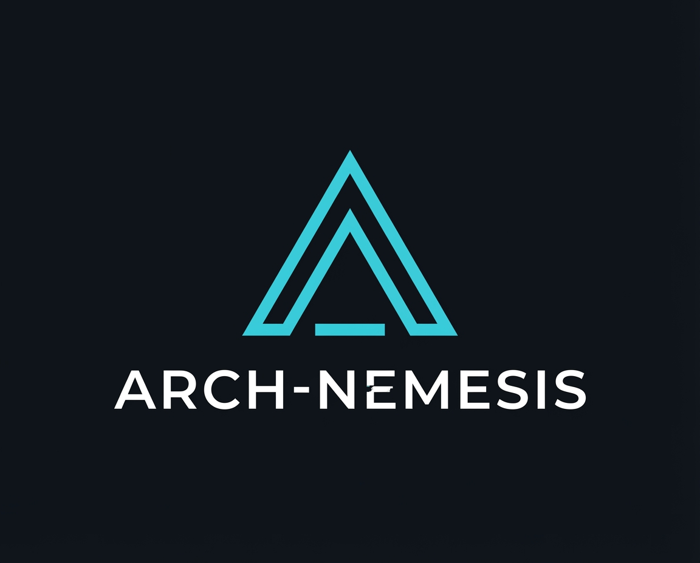

# 💀 Arch-Nemesis

  

**Arch-Nemesis** is a 24/7 interactive livestream experiment where YouTube Live Chat viewers have direct, raw control over a real Arch Linux virtual machine. 

Can the community build a functional workspace, or will it descend into terminal chaos? 

## 🚀 Features

- **Direct Chat Integration**: Commands typed in YouTube chat are relayed in real-time to the VM.
- **Hardened for Chaos**: Custom guest-side hardening scripts prevent intentional reboots, shutdowns, or account lockouts.
- **Beautiful OBS Overlays**: Includes dynamic command logs and a live cheatsheet for viewers.
- **Advanced Input Mapping**: Supports full keyboard strings, special keys (Ctrl, Alt, Meta), and absolute mouse positioning.

## 🛠 Project Structure

- `host/`: Contains the `controller.py` script that listens to YouTube chat and sends inputs via `libvirt`.
- `guest/`: Contains the `harden_vm.sh` script to be run inside the Arch VM to secure it.
- `overlay/`: HTML/JS overlays for OBS Browser Sources.

## ⌨️ Viewer Commands

| Command | Action |
| :--- | :--- |
| `!type [text]` | Types whole strings into the VM |
| `!key [name]` | Presses special keys (e.g., `!key enter`, `!key tab`) |
| `!mouse [x] [y]` | Moves the cursor (0-100 scale) |
| `[single char]` | Pressing 'w', 'a', 's', 'd' etc. works instantly. |

## 🔧 Setup

### 1. Host Setup
1. Create a Python virtual environment: `python -m venv venv`
2. Install requirements: `./venv/bin/pip install -r host/requirements.txt`
3. Run the controller: `./venv/bin/python host/controller.py --video-id [VIDEO_ID] --vm-name [VM_NAME]`

### 2. Guest Setup
1. Copy `guest/harden_vm.sh` to the VM.
2. Run as root: `sudo ./harden_vm.sh`
3. **Note your secret chattr name!** The script renames `chattr` to prevent viewers from lifting the hardening.

### 3. OBS Setup
1. Add `overlay/index.html` (Command Log) and `overlay/commands.html` (Cheatsheet) as Browser Sources.

---
*Created with 💀 by r3dg0d*
